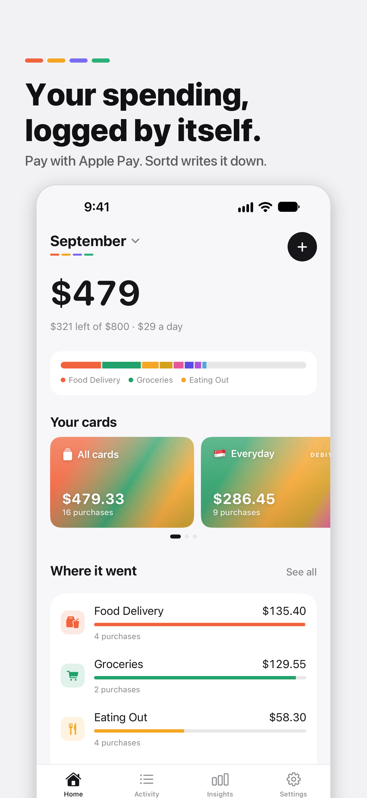
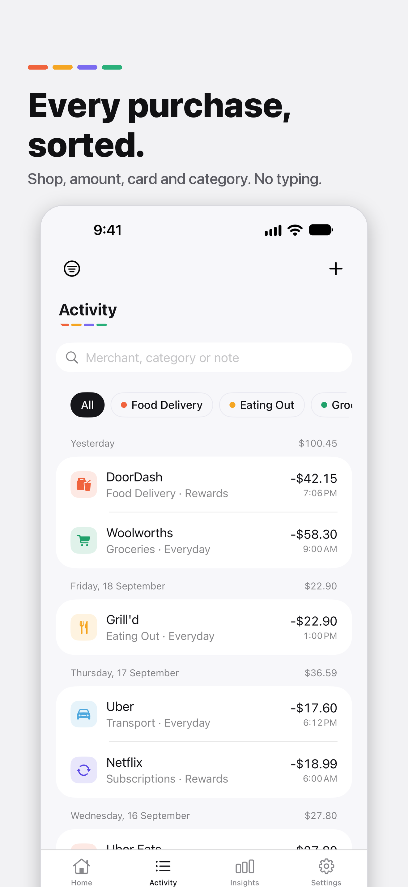
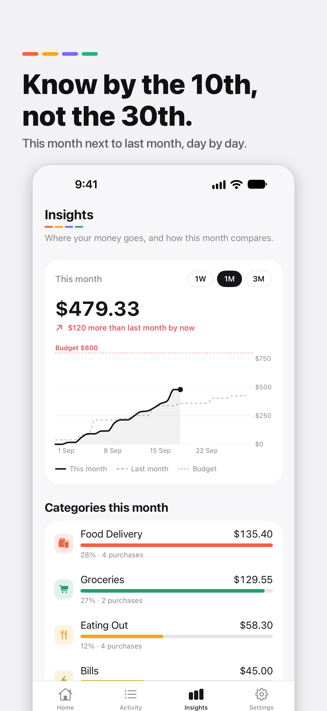
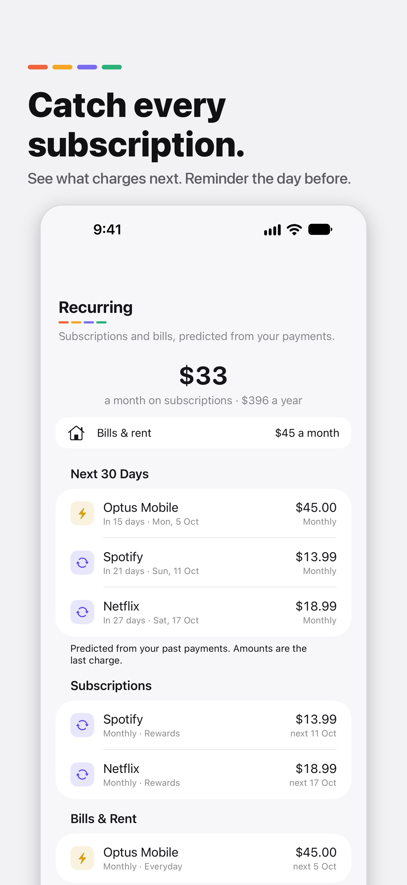
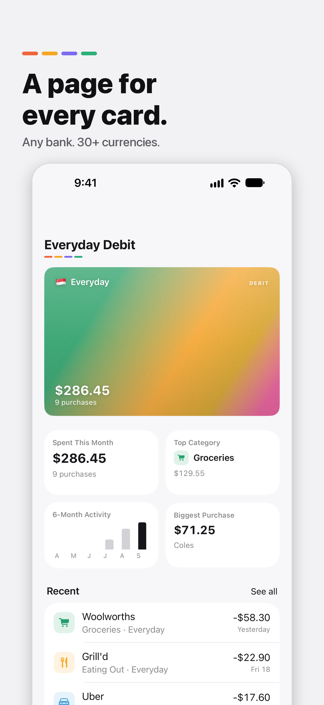

# Sortd: Spending Tracker

An iPhone app that logs your spending by itself. Pay with Apple Pay and Sortd writes it down. No bank login, and your purchases stay on your phone.

**Site:** [sortd.page](https://sortd.page) · **Status:** TestFlight beta (build 1.0) · **Price:** free

<p>
  
  
  
  
  
</p>

## Why I built it

I pay for almost everything with my phone, in two currencies (AUD and SGD), and I never knew where the money went. Every tracker I tried wanted my bank password or made me type each purchase in. I wanted one that fills itself in and keeps the data on my phone.

## What it does

- **Logs Apple Pay taps by itself.** One Shortcuts automation hands each tap to the app through an App Intent.
- **Reads paper receipts** with the camera, on the device.
- **Imports bank statements** to bring in past spending.
- **30+ currencies**, converted on the phone at that day's European Central Bank rate.
- **Sorts every purchase into a category**, and catches the same purchase arriving twice from two sources.
- **Insights, budgets, subscriptions and bills**, plus home-screen widgets and Siri questions.
- **Private by design.** No ads and no bank passwords. Purchases stay on the iPhone, with an optional encrypted backup to the user's own iCloud.

## How it is built

| Part | Stack | Where |
|---|---|---|
| iPhone app | Swift 6, SwiftUI, SwiftData, Swift Charts, App Intents, WidgetKit, StoreKit 2 | `Spend/`, `SortdWidget/` |
| Unit tests | Swift Testing, in-memory store | `SpendTests/` |
| Account service | TypeScript on Cloudflare Workers, App Attest, Vitest | `worker/` |
| Website | Plain HTML, CSS and JS on Cloudflare | `site/` |
| CI | GitHub Actions: build and test on every pull request | `.github/workflows/` |

Some numbers: about 29,000 lines of Swift in the app, 1,270+ unit tests, 135+ merged pull requests.

A few design choices worth a look:

- **One way in.** Every source (tap, receipt, statement, manual entry) goes through `TransactionLogger`, which sorts and de-duplicates. Nothing else inserts a purchase.
- **The server stores nothing.** The only backend is a small Worker that deletes accounts. It holds the two keys that cannot ship inside an app, checks each request with App Attest, and keeps no data. See [`worker/README.md`](worker/README.md).
- **Backup without a sync server.** The backup is one encrypted record in the user's own private iCloud.
- **Gates in scripts, not in habits.** Git hooks block secrets, debug flags outside `#if DEBUG`, and direct pushes to `main`. See [`scripts/`](scripts/).

## How it was made: me and Claude Code

I built Sortd with [Claude Code](https://claude.com/claude-code), and the commit history shows it: nearly every commit is co-authored with Claude. I have left that history as it is.

What I did:

- Decided what to build and what to leave out, and approved every spec in [`docs/specs/`](docs/specs/) before any code was written.
- Set up the pipeline the work runs through: ten agents with one job each (builder, test writer, code reviewer, abuse tester, UI tester and more), fixed scripts, and gates that only I can open. The design is in [`docs/AgentPipeline.md`](docs/AgentPipeline.md) and the agents are in [`.claude/agents/`](.claude/agents/).
- Tested each build on my own phone, triaged the bug hunts in [`docs/`](docs/), and decided what got merged.
- Ran the release: the Apple Developer account, signing, TestFlight, the App Store record, and the site.

What Claude did: wrote most of the Swift, TypeScript and tests, working from those specs and inside those gates.

## Run it

Needs a Mac with Xcode 27 and an iOS 27 simulator.

```bash
git clone https://github.com/kameshraj912/sortd.git
cd sortd
scripts/build.sh     # compile
scripts/test.sh      # run the test suite
open Spend.xcodeproj # or run it from Xcode
```

On the first screen, tap **Explore with sample data** to see the app filled in. Analytics and crash reports stay off unless you add your own keys (see `Secrets.xcconfig.example`).

## Known gaps

- Refunds and reversals do not come back through Apple Pay, so tap-logged totals can drift up.
- Cash and cards that are not in Apple Pay are added by hand, with the camera, or from a statement.
- Restoring a backup needs the same iCloud Keychain. There is no other copy.

## Contact

Kameshraj (Raj) Gnanaprakasam · [LinkedIn](https://www.linkedin.com/in/gkameshraj) · support@sortd.page

The code is public to read. It is not open source: all rights reserved.
